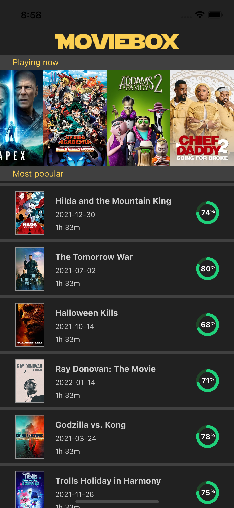

### Realization

1. **What I use in the project**
	* CocoaPods - to install an additional frameworks
		* pod "AlamofireImage"
  		* pod "RxSwift"
  		* pod "RxGesture"
  		* pod "RxAlamofire"
    	* pod "RxBlocking"
    	* pod "RxTest"
	* architecture MVVM
	* navigation is realized in Coordinations
	* application is written in the reactive way of programing
		* for networking is used RxAlamofire which provide Observable with returned Data
		* DataSource is bound to Observable
		* ViewModel is bound to View with RxSwift
	* Dependency Injection - to injects the services
	* AlamofireImage - Cache images - it is one of requirements

2. **Screenshots Video**




[](movie.mp4)


3. **What I didn't do because I didn't have enought time for it**
	* I should add waiting indicator when network calls are being done
	* Some cleaning code like Constants in Views
	* Localized Strings (there were only 2 static Strings - I decided to omit this)
	* I tried to write as many as posible tests but I run out time
	
### Implematation RatingView

```
import UIKit

final class RatingView: UIView {

    // MARK: RatingView properties
    
    private var color: UIColor = UIColor.clear
    private var backgroundTrackColor: UIColor = UIColor.clear
    private var percentage: CGFloat = 100
    var rating: CGFloat {
        get { percentage }
        set {
            if newValue < 0 {
                percentage = 0
            } else if newValue > 100 {
                percentage = 100
            } else {
                percentage = newValue
            }
            setNeedsDisplay()
        }
    }

    // MARK: - Initialization
    
    override init(frame: CGRect) {
        super.init(frame: frame)
        self.backgroundColor = UIColor.clear
    }

    required init(coder aDecoder: NSCoder) {
        super.init(coder: aDecoder)!
        self.backgroundColor = UIColor.clear
    }
    
    // MARK: - setup UI

    override func draw(_ rect: CGRect) {
        calculateColors()
        drawPercentage(rect)
        drawText(rect)
        return
    }
    
    private func drawPercentage(_ rect: CGRect) {
        let center: CGPoint = CGPoint(x: rect.midX, y: rect.midY)
        let radius: CGFloat = rect.width / 2
        var pathWidth: CGFloat = 5
        
        if radius < pathWidth {
            pathWidth = radius
        }
        let (trackStartingPoint, trackPercentageEndingPoint) = self.calculateStartAndEnd()

        let backgroundTrackPath = UIBezierPath(arcCenter: center, radius: radius - (pathWidth / 2), startAngle: trackStartingPoint, endAngle: 2.0 * .pi, clockwise: true)
        backgroundTrackPath.lineWidth = pathWidth
        self.backgroundTrackColor.setStroke()
        backgroundTrackPath.stroke()

        let percentageTrackPath = UIBezierPath(arcCenter: center, radius: radius - (pathWidth / 2), startAngle: trackStartingPoint, endAngle: trackPercentageEndingPoint, clockwise: true)
        percentageTrackPath.lineWidth = pathWidth
        percentageTrackPath.lineCapStyle = .round
        self.color.setStroke()
        percentageTrackPath.stroke()
    }
    
    private func drawText(_ rect: CGRect) {
        let percentageString = "\(Int(self.percentage))"
        let size  = Fonts.bold12.sizeOfString(string: percentageString, constrainedToWidth: Double(self.frame.width))
        percentageString.draw(at: CGPoint(x: rect.midX - size.width / 2 - 3, y: rect.midY - size.height / 2), withAttributes: [
            NSAttributedString.Key.font: Fonts.bold12,
            NSAttributedString.Key.foregroundColor: UIColor(named: "white") ?? UIColor.clear])
        
        let percentageStr = "%"
        percentageStr.draw(at: CGPoint(x: rect.midX + size.width / 2 - 3, y: rect.midY - size.height / 2), withAttributes: [
            NSAttributedString.Key.font: Fonts.bold8,
            NSAttributedString.Key.foregroundColor: UIColor(named: "white") ?? UIColor.clear])
    }
    
    // MARK: - support methods
    
    private func calculateStartAndEnd() -> (trackStartingPoint: CGFloat, trackPercentageEndingPoint: CGFloat) {
        let initialPoint: CGFloat = -25
        let trueFillPercentage = self.percentage + initialPoint
        let startPoint: CGFloat = ((2 * .pi) / 100) * (CGFloat(initialPoint))
        let endPoint: CGFloat = ((2 * .pi) / 100) * (CGFloat(trueFillPercentage))
        return(startPoint, endPoint)
    }
    
    private func calculateColors() {
        color = self.percentage < 50 ? UIColor(named: "yellow") ?? UIColor.clear : UIColor(named: "green") ?? UIColor.clear
        
        backgroundTrackColor = self.percentage < 50 ? UIColor(named: "yellow_dark") ?? UIColor.clear : UIColor(named: "green_dark") ?? UIColor.clear
    }
}

```

### Functionalities
Functionalities in the app:

1. **List horizontally currently playing movies**
	* [x] Client API details 
		* [x] GET https://api.themoviedb.org/3/movie/now_playing?language=en-US&page=undefined&api_key=55957fcf3ba81b137f8fc01ac5a31fb5
		* [x] Only display poster images in the horizontal scrolling list view.
		* [x] No pagination necessary.
	
2. **Display the most popular movies in the vertical list view, with multiple pages**
	* [x] Client API details  
		* [x] GET https://api.themoviedb.org/3/movie/popular?api_key=55957fcf3ba81b137f8fc01ac5a31fb5&language=en-US&page=1
		* [x] Use the parameter page to change the list's page.
	* [x] Implement the paging mechanism to load a list of movies as the user scrolls down the list.
	* [x] Cache movie images, in order to make smooth scrolling.
	* [x] Implement the custom RatingView.
		* [x] Animation is not necessary.
		* [x] Use Yellow tint for movie ratings less than 50% and Green for 50% and above.
	* [x] Each list item will contain the following:
		* [x] Poster image
		* [x] Title
		* [x] Rating
		* [x] Duration
		* [x] Release date
	
3. **When a user clicks on any movie list item, it will navigate to a detailed screen, with more information about the movie**
	* [x] Client API details 
		* [x] GET https://api.themoviedb.org/3/movie/{MOVIE_ID}?api_key=55957fcf3ba81b137f8fc01ac5a31fb5&language=en-US
		* [x] Where MOVIE_ID should be replaced with the id of the movie.
		* [x] Example: https://api.themoviedb.org/3/movie/464052?api_key=55957fcf3ba81b137f8fc01ac5a31fb5&language=en-US
	* [x] Detail screen should contain the following information:
		* [x] Poster image 
		* [x] Use the API as per described: https://developers.themoviedb.org/3/getting-started/images
		* [x] Duration
		* [x] Title
		* [x] Overview
		* [x] Release date
		* [x] List of genres
	
### Additional Requirements And Restrictions
We expect you to follow this additional requirements and restrictions, as it will be part of how we evaluate your assignment:

1. [x] Provide Unit Tests. This is very important for us to evaluate your level of seniority, so please spare some time to spend on developing Unit Tests.
2. [x] 3rd party libraries are allowed (except for the rating view). However, do not use any Alpha version of libraries.
3. [x] This is not an ordinary assignment. If you notice any strange behavior, you are free to make decisions regarding the implementation or to take things out of scope, as long as your decision can be justified.
4. [x] Provide a README.md explaining your approach, which includes the image caching but also the rating view implementation and any other important decision or assumptions you made during development. Also, list all the 3rd party libraries used and the reason why.
5. [x] You should follow the layouts provided to develop the functionalities.
6. [x] The code of the assignment has to be delivered along with the git repository (.git folder). We want to see your progress. We require a cloud-hosted repository on Gitlab, which *MUST* be PRIVATE.
7. **Do not open PRs to the main repository.**
8. [x] You are free to handle extra requirements, and this will be part of how we evaluate your work.
7. [x] The application should be developed in portrait mode only.
9. [x] Minimum Supported versions:
	* Android - 5.0 +
	* iOS - 14.0 +
10. [x] Do not use any hybrid solutions, such as Reactive Native or Flutter.
